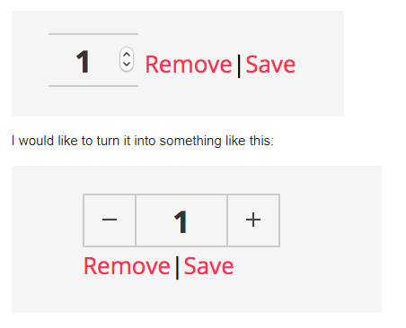

# 아직 못 하는 것 못 해 본 것

숫자 인풋창 커스터마이징

[html - Customizing Increment Arrows on Input of Type Number Using CSS - Stack Overflow](https://stackoverflow.com/questions/45396280/customizing-increment-arrows-on-input-of-type-number-using-css)

[css - How can I make button minus and plus on the bootstrap vue? - Stack Overflow](https://stackoverflow.com/questions/52658814/how-can-i-make-button-minus-and-plus-on-the-bootstrap-vue/52659263)

tui 그리드 내부에서 구현할 경우 포메터로 모양은 구형가능하나 뷰가 작동하지 않음

커스텀 렌더러이용으로 방향선회